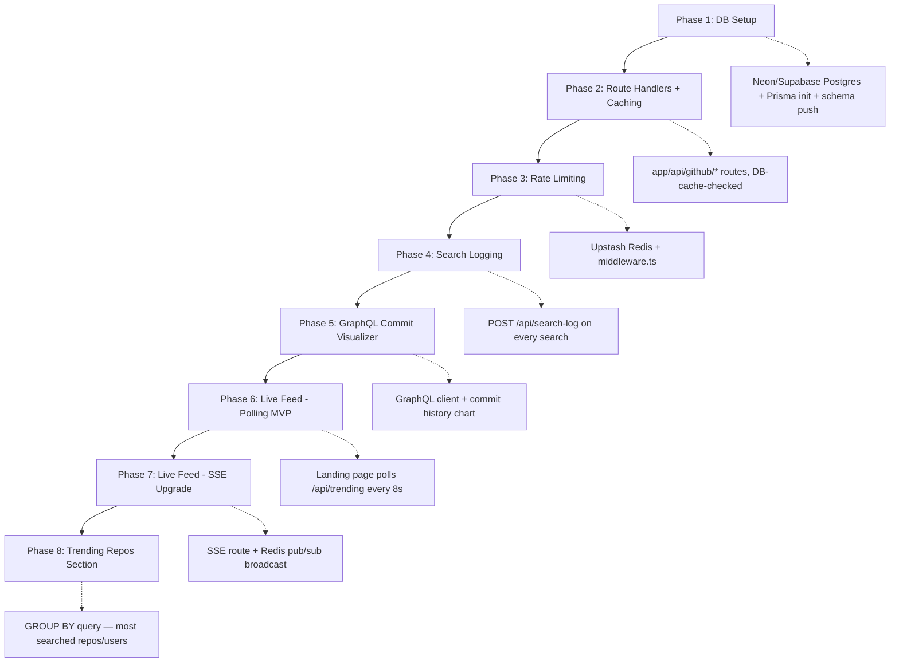

# Slatex — Project Roadmap

> Ye file project ke root mein `ROADMAP.md` ke naam se rakho. Jab bhi confuse ho ki "ab kya karna hai", yahi file dekho.

---

## 1. Abhi Tak Kya Bana Hai (Current State)

- Next.js 15 (App Router) + TypeScript + Tailwind CSS
- GitHub **REST API** se direct fetch — Server Components ke through
- `lib/api/github/` layer bana hua hai (types, errors, endpoints, client, services) — koi backend nahi, sab kuch Next.js ke andar hi
- Commit activity heatmap — REST ke `stats/commit_activity` endpoint se (26-week data, 202-async handling)
- README renderer, language chart, repo/user dashboards — sab kaam kar rahe hain
- Caching sirf Next.js ka built-in `fetch({ next: { revalidate } })` — apna DB-cache nahi
- Rate limiting koi nahi — sirf optional `GITHUB_TOKEN`

**Decision:** Ab hum **poora Next.js ke andar hi** full-stack banayenge — alag Express server nahi. Next.js ke **Route Handlers** (`app/api/*/route.ts`) hi tumhara backend banenge. Isse ek hi deployment (Vercel), ek hi repo, aur ek hi tech stack maintain karna padega.

---

## 2. Final Tech Stack (100% Next.js)

| Layer | Tech | Kyun |
|---|---|---|
| Frontend | Next.js 15 (App Router), TypeScript, Tailwind | already hai |
| Backend | Next.js **Route Handlers** (`app/api/**/route.ts`) | alag server maintain nahi karna, same deploy |
| Database | PostgreSQL | structured data — search logs, cached repos, aggregation queries |
| ORM | Prisma | type-safe, migrations, Next.js ke saath first-class support |
| DB Hosting | Neon / Supabase / Railway (serverless-friendly Postgres) | Vercel serverless ke saath connection-pooling zaroori hai — normal Postgres connection serverless mein exhaust ho jaate hain |
| Caching + Rate Limit store | **Upstash Redis** | serverless environment mein in-memory cache/rate-limit kaam nahi karta (har request naya function instance ho sakta hai) — Redis ek shared external store deta hai |
| Realtime | Server-Sent Events (SSE) + Upstash Redis Pub/Sub, **ya** Pusher/Ably (managed) | neeche section 6 mein detail |
| GraphQL client | raw `fetch()` (koi extra library ki zaroorat nahi, simple POST request hi hai) | GitHub GraphQL v4 ke liye |
| Charts | Recharts | already package.json mein hai |

---

## 3. REST → GraphQL Conversion Plan

Abhi tumhara commit-activity REST ke `stats/commit_activity` se aata hai — ye sirf **weekly totals** deta hai (26 hafton ka data, per-day breakdown). GraphQL se tumhe **actual commit-level data** (message, additions/deletions, exact date) milega — jisse zyada detailed aur accurate chart banega.

### Step-by-step:

**Step 1 — GraphQL client banao**
```
lib/api/github/graphql/client.ts   → githubGraphQL<T>() function
lib/api/github/graphql/queries.ts  → query strings yahan rakho
```

**Step 2 — Query likho (commit history ke liye)**
```graphql
query ($owner: String!, $name: String!) {
  repository(owner: $owner, name: $name) {
    defaultBranchRef {
      target {
        ... on Commit {
          history(first: 100) {
            edges {
              node {
                committedDate
                additions
                deletions
                message
              }
            }
          }
        }
      }
    }
  }
}
```

**Step 3 — Data transform karo (raw commits → daily aggregated data)**
```ts
function aggregateByDay(edges: CommitEdge[]) {
  const daily: Record<string, { date: string; commits: number; additions: number; deletions: number }> = {};
  for (const { node } of edges) {
    const date = node.committedDate.split("T")[0];
    daily[date] ??= { date, commits: 0, additions: 0, deletions: 0 };
    daily[date].commits += 1;
    daily[date].additions += node.additions;
    daily[date].deletions += node.deletions;
  }
  return Object.values(daily).sort((a, b) => a.date.localeCompare(b.date));
}
```

**Step 4 — REST wala `getRepoCommitActivity()` ko deprecate mat karo, use fallback rakho**
- GraphQL **hamesha token maangta hai** — agar `GITHUB_TOKEN` na ho, REST wala 26-week heatmap fallback ki tarah kaam karta rahega.
- Naya function: `getCommitHistory(owner, repo)` — GraphQL se detailed additions/deletions chart ke liye, jo `CommitActivity` component ke paas ek naye "detailed view" toggle ke roop mein dikhaya ja sakta hai.

**Step 5 — Recharts se chart banao**
```tsx
<AreaChart data={dailyData}>
  <Area dataKey="additions" stroke="#22c55e" fill="#22c55e33" />
  <Area dataKey="deletions" stroke="#ef4444" fill="#ef444433" />
</AreaChart>
```

---

## 4. Complete Folder Structure (Frontend + Backend, All Next.js)

```
slatex/
├── app/
│   ├── layout.tsx
│   ├── page.tsx                          # landing + search
│   ├── globals.css
│   ├── profiles/
│   │   ├── page.tsx
│   │   └── loading.tsx
│   ├── repo/
│   │   ├── page.tsx
│   │   └── loading.tsx
│   └── api/                              # 🆕 YEH TUMHARA "BACKEND" HAI
│       ├── github/
│       │   ├── user/[username]/route.ts       # GET — cache-checked GitHub user
│       │   ├── repo/[owner]/[repo]/route.ts    # GET — cache-checked repo data
│       │   └── commits/[owner]/[repo]/route.ts # GET — GraphQL commit history
│       ├── search-log/
│       │   └── route.ts                        # POST — search event save karta hai
│       ├── trending/
│       │   └── route.ts                        # GET — most-searched repos (aggregation)
│       └── live-feed/
│           └── route.ts                        # GET — SSE stream (realtime feed)
│
├── components/
│   ├── ui/                               # button, card, badge, tooltip
│   ├── user/                             # hero-section, stats-cards, language-chart, repo-grid
│   ├── repo/                             # repo-header, repo-stats, commit-activity, commit-timeline,
│   │                                     # contributors-list, language-pie, readme-viewer
│   ├── landing/
│   │   └── live-search-feed.tsx          # 🆕 landing page ka live activity feed
│   └── shared/                           # empty-state, back-button, copy-toast
│
├── lib/
│   ├── api/
│   │   └── github/
│   │       ├── client.ts                 # REST fetcher (token, errors, cache-check)
│   │       ├── types.ts
│   │       ├── errors.ts
│   │       ├── endpoints.ts
│   │       ├── graphql/
│   │       │   ├── client.ts             # githubGraphQL()
│   │       │   └── queries.ts
│   │       └── services/
│   │           ├── users.ts
│   │           ├── repos.ts
│   │           ├── commits.ts            # REST (heatmap) + GraphQL (detailed) dono
│   │           ├── readme.ts
│   │           └── contributions.ts      # GraphQL contribution-calendar + REST fallback
│   ├── db/
│   │   ├── prisma.ts                     # Prisma client singleton
│   │   └── cache.ts                      # getCachedRepo(), setCachedRepo() — TTL check
│   ├── ratelimit.ts                      # Upstash-based rate limiter helper
│   ├── realtime/
│   │   └── publisher.ts                  # Redis pub/sub publish + subscribe helpers
│   └── utils.ts
│
├── prisma/
│   ├── schema.prisma
│   └── migrations/
│
├── middleware.ts                         # /api/* pe rate-limit apply karta hai
├── .env.example
└── ROADMAP.md                            # ← yehi file
```

### Prisma Schema (starting point)

```prisma
model SearchLog {
  id           String   @id @default(cuid())
  ipAddress    String
  searchQuery  String
  searchType   String   // "user" | "repo"
  searchedAt   DateTime @default(now())

  @@index([searchedAt])
}

model CachedRepository {
  id          String   @id @default(cuid())
  ownerRepo   String   @unique   // "facebook/react"
  dataJson    Json
  starsCount  Int
  cachedAt    DateTime @default(now())
}
```

---

## 5. Caching + Rate Limiting — Next.js Route Handlers Mein

**Rate limiting (`middleware.ts`):**
```ts
import { Ratelimit } from "@upstash/ratelimit";
import { Redis } from "@upstash/redis";

const ratelimit = new Ratelimit({
  redis: Redis.fromEnv(),
  limiter: Ratelimit.slidingWindow(30, "60 s"), // 30 req/min per IP
});

export async function middleware(req: Request) {
  const ip = req.headers.get("x-forwarded-for") ?? "unknown";
  const { success } = await ratelimit.limit(ip);
  if (!success) {
    return new Response("Too many requests", { status: 429 });
  }
}

export const config = { matcher: "/api/:path*" };
```

**Caching (`lib/db/cache.ts`):**
```ts
export async function getCachedRepo(ownerRepo: string) {
  const cached = await prisma.cachedRepository.findUnique({ where: { ownerRepo } });
  if (cached && Date.now() - cached.cachedAt.getTime() < 60 * 60 * 1000) {
    return cached.dataJson;
  }
  return null; // stale ya missing — GitHub se fetch karo
}
```

Route Handler mein flow: **DB cache check → hit hai toh return → miss hai toh GitHub call → DB save → return.**

---

## 6. Realtime Feed — Honest Trade-off (Serverless Constraint)

Socket.io **Vercel serverless pe reliably nahi chalega** (persistent connection chahiye, serverless functions stateless hote hain). "Sab kuch Next.js mein" rakhne ke liye do practical options:

| Option | Kaise | Trade-off |
|---|---|---|
| **SSE + Upstash Redis Pub/Sub** | Route Handler ek `ReadableStream` return karta hai, Redis se subscribe karke naye events push karta hai | Thoda complex setup, lekin fully "apna" system, seekhne layak |
| **Pusher / Ably (managed)** | Unka SDK client aur server dono jagah use hota hai | Sabse simple implement karna, kam control |
| **Polling (MVP ke liye)** | Landing page har 5-10 sec mein `/api/trending` ko poll kare | Sabse aasan, "real-time" nahi lekin kaam chala sakta hai shuruaat mein |

**Suggestion:** Pehle **polling** se MVP banao (kaam turant chalu ho jayega), phir seekhne ke liye SSE + Redis Pub/Sub try karo jab baaki sab stable ho jaye.

---

## 7. Upcoming Features Roadmap



**Phase order zaroori hai:** GraphQL (Phase 5) se pehle caching (Phase 2) complete karo — warna GraphQL calls bhi bina-cache ke chalengi aur rate-limit jaldi khatam hoga.

---

## 8. Docs Padho Building Se Pehle

| Topic | Link |
|---|---|
| Next.js Route Handlers | nextjs.org/docs/app/building-your-application/routing/route-handlers |
| Next.js Middleware | nextjs.org/docs/app/building-your-application/routing/middleware |
| Prisma + Next.js | prisma.io/docs/guides/nextjs |
| Prisma schema basics | prisma.io/docs/orm/prisma-schema |
| PostgreSQL basics | postgresql.org/docs/current/tutorial.html |
| Upstash Redis (rate limit) | upstash.com/docs/redis/sdks/ratelimit-ts/overview |
| Upstash Redis Pub/Sub | upstash.com/docs/redis/features/pubsub |
| GitHub GraphQL API | docs.github.com/en/graphql |
| GitHub GraphQL Explorer (test queries) | docs.github.com/en/graphql/overview/explorer |
| Server-Sent Events (MDN) | developer.mozilla.org/en-US/docs/Web/API/Server-sent_events |
| Recharts docs | recharts.org/en-US/api |

---

## 9. End-to-End Feature List (Final Vision)

1. User GitHub username/repo search karta hai
2. Request `app/api/github/*` route handler pe jaati hai (GitHub ko seedha nahi)
3. Middleware pehle rate-limit check karta hai (per-IP)
4. Route handler Postgres cache check karta hai — fresh data hai toh wahi return
5. Stale/missing hai toh GitHub REST/GraphQL call, DB update, return
6. Search event `SearchLog` table mein save (async, response block nahi karta)
7. Landing page trending/live feed dikhata hai (polling se shuru, baad mein SSE)
8. Repo page pe do commit views: REST-based heatmap (fast, approximate) + GraphQL-based detailed chart (additions/deletions per day)
9. Sab kuch ek hi Next.js app, ek hi Vercel deployment

---

**Agla step:** Phase 1 — Neon ya Supabase pe free Postgres banao, Prisma install karo (`npm install prisma @prisma/client`), `npx prisma init`, schema likho (upar diya hua), `npx prisma db push` chalao. Ye ho jaye toh bata dena, Phase 2 (Route Handlers + cache logic) ka full code de dunga.